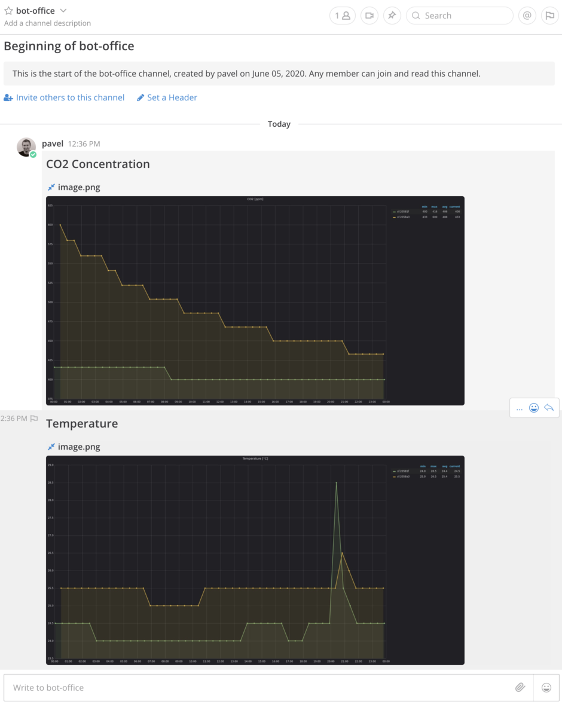

# grafana2mm - Grafana to Mattermost

This repository contains Python 3 application for capturing **Grafana panel(s)** from the previous day and sending them to **Mattermost channel(s)** with an optional message. Everything is configured via a TOML configuration file. You can define multiple Mattermost channels and Grafana panels to be fetched/fed.

The application is typically deployed via Docker. The Docker image is built by the user (`Dockerfile` is included).

This is the example output when the application has run:

Enjoy proactive sharing of Grafana panels with your friends!

## Requirements

* Docker
* Grafana
* Mattermost

## Download

Get the latest released version from [**Releases**](https://github.com/hardwario/grafana2mm/releases) and unpack it:

    $ wget -c https://github.com/hardwario/grafana2mm/archive/vX.Y.Z.tar.gz -O - | tar -xz

> Note: Replace `X.Y.Z` in the commands above with the latest release version.

## Build

After the release has been downloaded and unpacked, it is necessary to build the Docker image.

It can be done with these commands:

    $ cd grafana2mm
    $ docker build --tag grafana2mm .

## Configuration

You have to prepare the configuration file first. The included `config.toml` is a good starting point. The configuration file is not a part of the Docker image but it is supplied to the Docker container when started.

> Attention: Because the configuration file contains sensitive credentials, make sure you set the proper permissions on it.

## Usage

The tool can be run using this command:

    $ docker run --name grafana2mm --rm -it -v $(pwd)/config.toml:/app/config.toml grafana2mm

It is intended to put this command e.g. in your **crontab** to be run periodically. You can edit **crontab** with this commands:

    $ crontab -e

## Development

It is recommended to use `pyenv` + `venv` (`venv` is part of the standard Python distribution) to manage your Python environment. Here is the development environment activation procedure:

Switch to the Git repository:

    $ cd grafana2mm

Make sure the Python version matches the `.python-version` file:

    $ pyenv local

Create (just one) the virtual environment:

    $ python -m venv .venv

Activate the virtual environment:

    $ source .venv/bin/activate

Install all required dependencies:

    $ pip install -r requirements.txt

Verify the application runs:

    $ python app.py --version

Do not forget to change the version in the file `version.txt`.

## Authors

* [**Pavel Hübner**](https://github.com/hubpav) - Initial work

## License

This project is licensed under the [**MIT License**](https://opensource.org/licenses/MIT/) - see the [**LICENSE**](https://github.com/hardwario/grafana2mm/blob/master/LICENSE) file for details.
